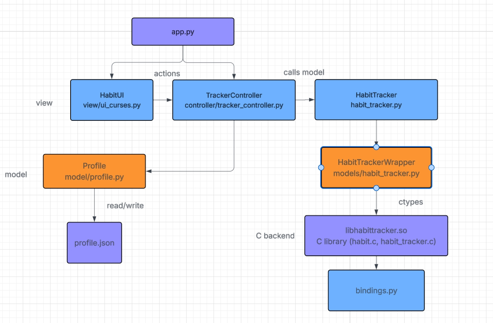
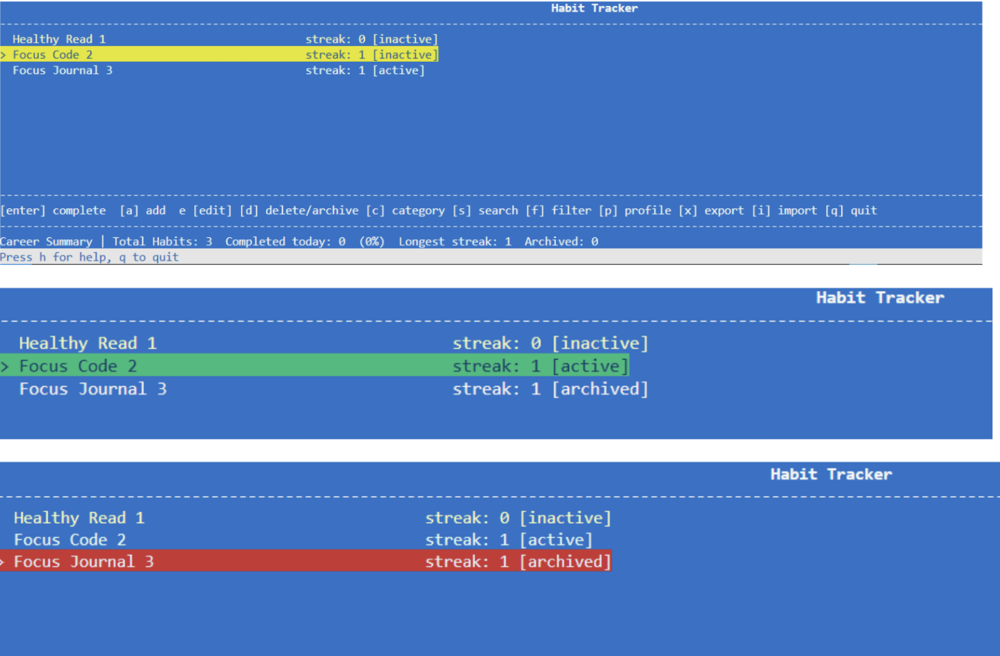
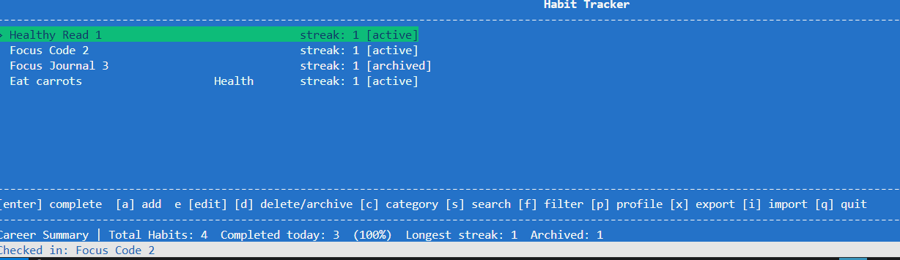
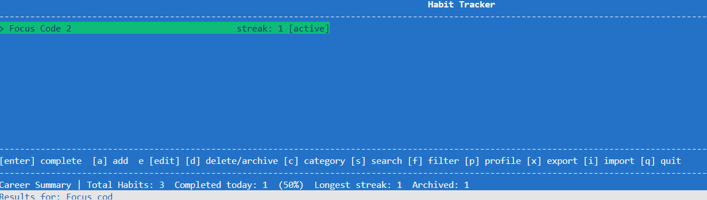
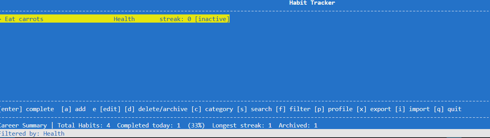
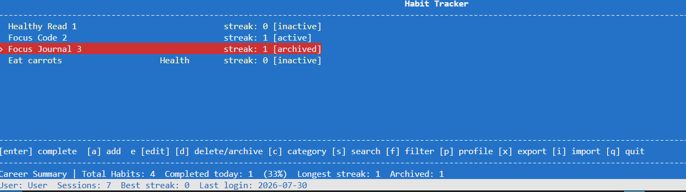
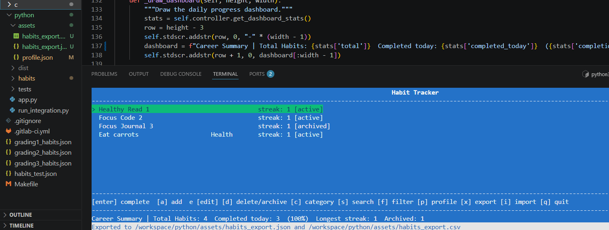

# A3 CIS*2750

## Student Information

Name: Bhakti Patel

Student ID: 1310411

U of G Email: bpatel21@uoguelph.ca

## Complete this Academic Integrity Statement
By placing my name below, I affirm that:

1. This submission is entirely my own work.
2. No portion of this work was completed, assisted, or generated by any third party, whether human, AI, or software tool, except where explicitly permitted by the instructor.
3. I understand that possible violations of academic integrity will be addressed according to University of Guelph regulations.

Digital Signature (type your full name): Bhakti Patel

Date: July 29, 2026

## Implementation Summary:
**Which functions required the most design work?**

- I would say the curses UI required the most implementation work. I followed the ExampleUI/ExampleEngine patterns from the lecture, where the view handles all rendering and input and sends logic details to the controller. Overall, managing the screen redraws, keypad inputs, and coordinates on every frame took a while.
- Also, the MVC refactor required work. Separating the existing A2 into different layers like model, controller, and view was a little confusing at first. 
- Adding categories and search/filter and extended feature also took a while to think about. 

**What helper functions or structures did you introduce?**
- Habit (model/habit.py): wraps a single habit's data as a Python object.
- Profile (model/profile.py). manages user stats using profile.json
- TrackerController (controller/tracker_controller.py): coordinates all actions between the view and the model
- HabitUI (view/ui_curses.py): UI layout

**How did you organize your code?**
- Three layers, model, controller and view.

## Architecture Diagram:

## Screenshots:
Main habit list screen showing habits with status colors

Checking in a habit 

Search results after pressing `s` and typing a query

Filter by category after pressing `f`

Profile + Dashboard showing completed today, longest streak, archived count

Export confirmation in status bar after pressing `x`

## Testing Strategy
- All 43 of my own unit tests (using the Check framework) pass locally and in the grader’s compilation check.
- Tests are organized into three suites: HabitGenerator, HabitLoader, Habit
- Each function has tests for valid input, NULL/invalid input, and edge cases
- I also ran clang-tidy against every source file and resolved most reported issues, receiving a 15/15 lint score, and confirmed zero memory leaks/errors using valgrind.

Python Unit Tests:
- 38 tests covering the full Python API
- Tests exercise the ctypes bindings, HabitTrackerWrapper, and HabitTracker classes

## Known Limitations
- Habits cannot be deleted, only archived (did not have time to think much about it)
- Profile best streak is not automatically updated during a session
- Import does not check for duplicate habit names
- No scrolling for habit list, only up and down arrows

## Selected Extended Feature: Import / Export
- The import/export feature allows users to back up and restore habit data.

Export:
- Pressing `[x]` exports all current habits to two files in `python/assets/`:
- habits_export.json`: full habit data in JSON format
- `habits_export.csv`: habit data in CSV format for use in spreadsheets

Import
- Pressing `[i]` prompts for a file path. The app detects the format by file extension (`.csv` or `.json`) and imports each habit by calling `add_habit` for each record. 

## Refactoring Report (Extended Feature: Export/Import)

Problems Identified
Before I added import/export, there was no way to save habit data between sessions. Any habits added during a session would disappear when the app restarted, since the tracker always reloads from the config file at the start of program. There was also no way to backup habits, share them, or move them to a different environment. Basically the only habits that ever existed were the ones hardcoded in the config file, which made the tracker feel pretty limited for real use.

Refactoring Performed
I implemented everything in Python. The C backend did not need to change at all.
I added four new methods to `TrackerController`:
1. `export_habits_json()`: Gets all habits from the tracker, converts each one to a dictionary using `to_dict()`, and writes the list to a JSON file.
2. `export_habits_csv()`: Does the same thing but writes each habit as a row in a CSV file using `csv.DictWriter`.
3. `import_habits_json()`: reads a JSON file and calls `add_habit()` and `set_habit_category()` for each habit entry found.
4. `import_habits_csv()`: Reads a CSV file row by row and does the same.

Each import method uses try/except so that if one entry in the file is broken or missing fields, it just skips that entry and keeps going rather than crashing.

View (`ui_curses.py`)
I added 2 new key bindings to `HabitUI`:
- `[x]`: Runs export and shows the file paths in the status bar.
- `[i]`: Prompts the user to type a file path, figures out the format from the file extension, and calls the right import method.

The view itself does not do any file reading or writing. It just calls the controller methods, which keeps the MVC separation.

**Benefits of the New Design:**
Users can now export their habits at any time and import them back later. This means habits added during a session are not lost when the app restarts, which makes the tracker actually usable for long-term habit tracking.

Adding this feature only required changes to the controller and the view. The model layer and the C backend were completely untouched. This was a good sign that the MVC structure from the A3 refactor was working the way it was supposed to. New features could be added at the right layer without touching everything else.

The import methods just call `add_habit()` and `set_habit_category()`, which already existed and were already tested. I did not need to add any new C functions or change any bindings, which kept the change small and low risk.

Exporting to both JSON and CSV means the data works in different contexts. JSON is good for re-importing back into the tracker. CSV opens directly in Excel or Google Sheets, which is useful if someone wants to look at their habits outside the app.

If a file has a missing field or a malformed entry, the import skips that habit and continues with the rest. The app never crashes because of a bad import file.
